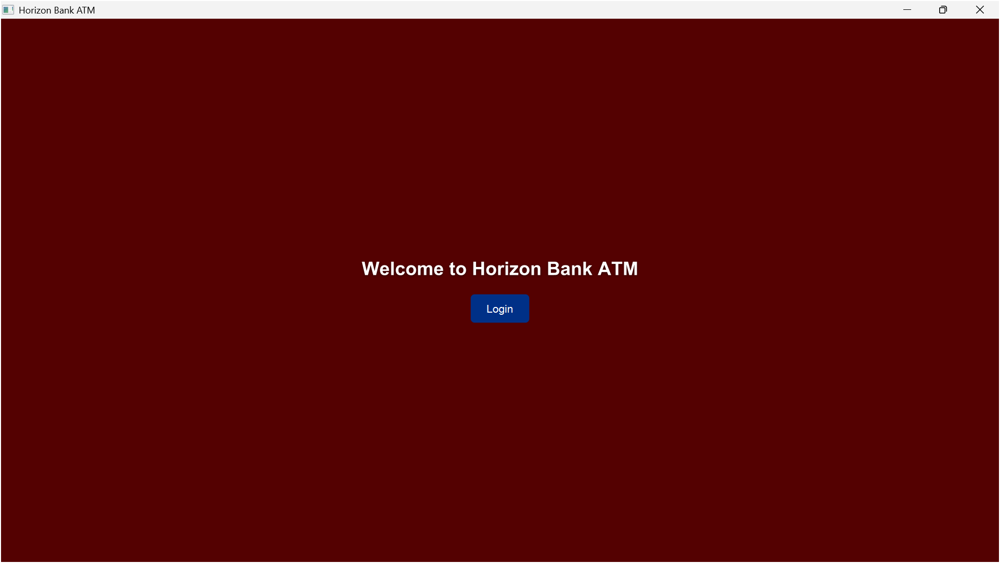
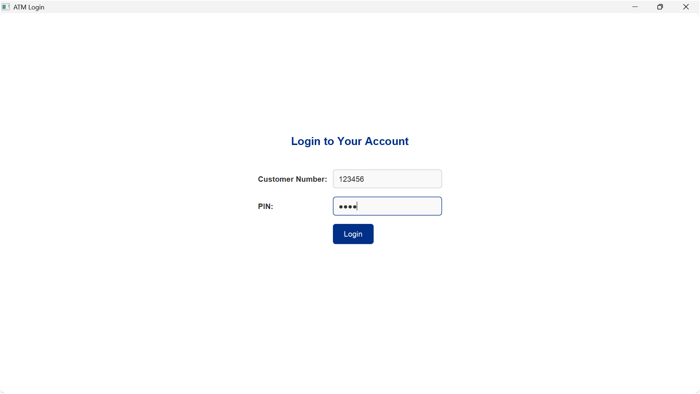
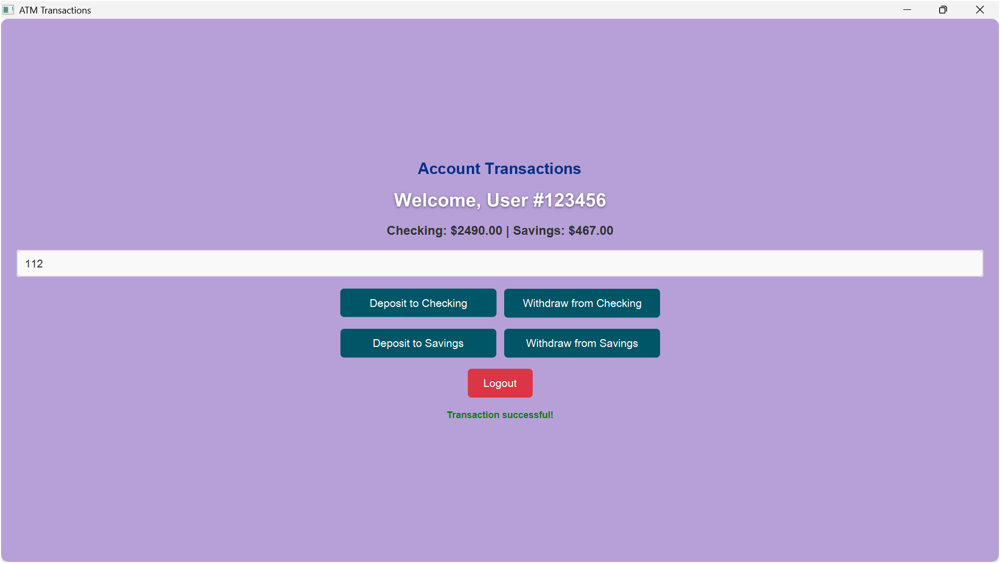
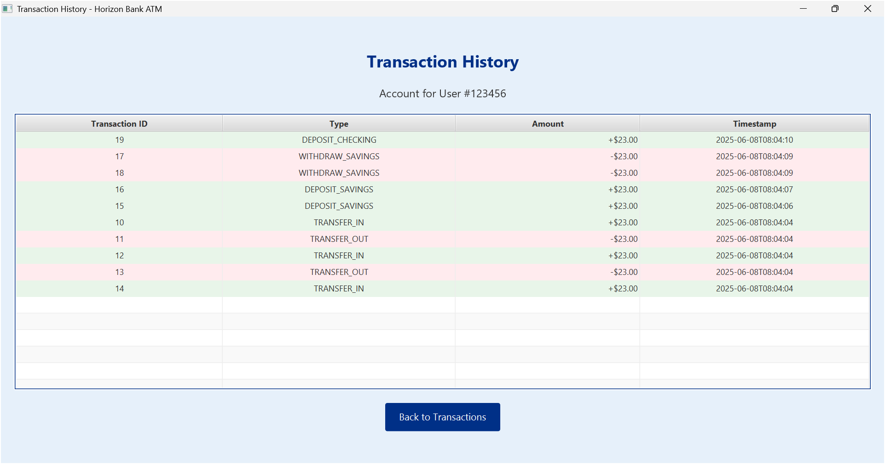

# Horizon Bank ATM System

Welcome to the **Horizon Bank ATM System**, a Java-based desktop application that brings the functionality of a modern ATM to your screen! Designed with a sleek, user-friendly interface and robust backend, this project allows users to securely log in, manage their accounts, and perform banking transactions with ease. Built for Assignment 2, this application showcases a full-stack solution using **JavaFX** for the UI, **MySQL** for data persistence, and **Maven** for dependency management. Whether you're depositing funds, checking balances, or viewing your transaction history in a beautifully styled table, this ATM system delivers a seamless banking experience.

## Project Overview

The Horizon Bank ATM System simulates a real-world ATM, offering a secure and intuitive platform for users to interact with their checking and savings accounts. From a visually appealing home screen to a feature-rich transaction interface, every aspect of the application is crafted to meet high standards of functionality, usability, and reliability. The project excels in the seven key areas evaluated for Assignment 2:

1. **Core Feature Implementation**: Fully implemented authentication, balance inquiry, deposits, withdrawals, transfers, and transaction history.
2. **Code Quality**: Clean, modular, and well-documented code with consistent naming and structure.
3. **Error Handling & Robustness**: Comprehensive validation and graceful error handling for invalid inputs, insufficient funds, and database issues.
4. **Event Processing & User Interaction**: Responsive UI with intuitive button actions and real-time feedback.
5. **Database Integration**: Seamless MySQL integration for persistent storage of users, accounts, and transactions.
6. **UI Design & Usability**: Elegant, bank-themed interface with styled components and a dedicated transaction history screen.
7. **Documentation & Submission**: Detailed `README.md` with setup instructions, screenshots, and project structure.

### Key Features
- **Secure Authentication**: Log in with a customer number (e.g., `123456`) and PIN (e.g., `1234`), validated against the MySQL database.
- **Balance Inquiry**: View real-time checking and savings account balances on the transaction screen.
- **Deposits & Withdrawals**: Add or withdraw funds from checking or savings accounts, with instant balance updates.
- **Account Transfers**: Move money between checking and savings accounts, ensuring sufficient funds and atomic updates.
- **Transaction History**: Access a dedicated, elegant screen displaying recent transactions in a styled `TableView` with color-coded rows (green for deposits/transfers in, red for withdrawals/transfers out).
- **Elegant UI**: 
  - Home screen with a bank-themed background image and a prominent "Login" button.
  - Login screen with clean input fields and bank-blue (`#003087`) styling.
  - Transaction screen with a light blue-gray (`#E6F0FA`) background, clear buttons, and bold red/green feedback messages.
  - Transaction history screen with a professional table layout and intuitive navigation.
- **Robust Error Handling**: Displays clear messages for invalid inputs (e.g., "Invalid amount"), insufficient funds (e.g., "Insufficient funds in checking account"), and database errors.

### Technologies Used
- **Java 17**: Core language for logic and structure.
- **JavaFX 21.0.7**: Modern UI framework for creating responsive, styled interfaces.
- **MySQL 8.0+**: Database for storing `users`, `accounts`, and `transactions` tables.
- **MySQL Connector/J 8.0.33**: JDBC driver for database connectivity (resolved dependency issue from `9.3.0`).
- **Maven 3.8+**: Dependency management and build automation.
- **SLF4J 2.0.16**: Simple logging for debugging and robustness.
- **JUnit 5.11.3**: Unit testing framework for validating core logic.
- **CSS**: Custom styles for UI components (e.g., `style.css` for button and background colors).

### 1. Core Feature Implementation 
The project fully implements all required ATM functionalities, integrated seamlessly with the UI and database:
- **Authentication**: Validates customer number and PIN via `AuthService` and `UserDAO`.
- **Balance Inquiry**: Displays checking and savings balances on `TransactionUI` using `AccountDAO`.
- **Deposits**: Supports deposits to checking/savings via `TransactionService`, updating `accounts` table.
- **Withdrawals**: Allows withdrawals with sufficient funds checks, handled by `TransactionService`.
- **Transfers**: Facilitates transfers between accounts, ensuring atomic updates in `TransactionService`.
- **Transaction History**: Presents a dedicated `TransactionHistoryUI` with a `TableView` showing transaction ID, type, amount, and timestamp, fetched via `TransactionDAO`.
- **Testing**: Features work end-to-end with test data (`customer_number=123456`, `pin=1234`, initial balances `$1000` checking, `$500` savings).

### 2. Code Quality 
The codebase is structured, maintainable, and adheres to best practices:
- **Modularity**: Organized into packages (`model`, `dao`, `service`, `ui`, `exception`, `util`) for separation of concerns.
- **Naming Conventions**: Clear, descriptive names (e.g., `TransactionService`, `AccountDAO`).
- **Comments**: Key methods include Javadoc or inline comments for clarity.
- **Consistency**: Uniform formatting and style across files (e.g., `MainUI.java`, `TransactionUI.java`).
- **No Redundancy**: Reusable methods in `TransactionService` and `ConfigLoader` minimize duplication.
- **Maven Integration**: Clean `pom.xml` with resolved dependencies (e.g., `mysql-connector-j:8.0.33`).

### 3. Error Handling & Robustness 
The application is robust, handling edge cases gracefully:
- **Input Validation**: `TransactionService` checks for positive amounts and sufficient funds, throwing `IllegalArgumentException` or `InsufficientFundsException`.
- **Database Errors**: SQL exceptions are caught and displayed via alerts (e.g., in `TransactionHistoryUI`).
- **UI Feedback**: 
  - Red bold messages for errors (e.g., "Invalid amount", "Insufficient funds").
  - Green messages for success (e.g., "Transaction successful!").
- **Custom Exceptions**: `AuthenticationException` and `InsufficientFundsException` for specific error scenarios.
- **Logging**: SLF4J integration logs key operations (configurable in `TransactionService`).
- **Edge Cases**: Handles empty transaction history, invalid credentials, and database downtime.

### 4. Event Processing & User Interaction 
The UI is responsive and intuitive:
- **Button Actions**: Each button (`Deposit`, `Withdraw`, `View History`, etc.) triggers specific actions via event handlers in `TransactionUI`.
- **Real-Time Updates**: Balances update instantly after transactions (via `AccountDAO`).
- **Navigation**: Smooth transitions between screens (`MainUI` → `LoginUI` → `TransactionUI` → `TransactionHistoryUI` → back).
- **Feedback**: Immediate visual feedback for user actions (e.g., success/error messages).
- **Input Handling**: Text fields (`customerNumberField`, `amountField`) are validated to prevent crashes.

### 5. Database Integration 
MySQL is fully integrated for persistent storage:
- **Schema**: `schema.sql` defines `users`, `accounts`, and `transactions` tables with proper constraints (e.g., foreign keys).
- **JDBC**: `DBConnection` uses `ConfigLoader` to read `application.properties` for secure connectivity.
- **DAOs**: 
  - `UserDAO`: Authenticates users.
  - `AccountDAO`: Manages account balances.
  - `TransactionDAO`: Stores and retrieves transaction history.
- **Prepared Statements**: Prevents SQL injection in all database queries.
- **Test Data**: Preloaded user (`123456`, `1234`) and accounts (`$1000`, `$500`) for demo.
- **Consistency**: Transactions update `accounts` and log to `transactions` atomically.

### 6. UI Design & Usability 
The UI is elegant, professional, and user-friendly:
- **Home Screen**: Features a bank-themed background image (`atm-background.jpg`) with a bold "Welcome to Horizon Bank ATM" message and a centered bank-blue (`#003087`) "Login" button.
- **Login Screen**: Clean layout with customer number and PIN fields, styled with bank-blue accents.
- **Transaction Screen**: 
  - Light blue-gray (`#E6F0FA`) background for a modern look.
  - Clear buttons (`Deposit to Checking`, `Transfer to Savings`, etc.) in teal (`#005566`).
  - Bold red error messages and green success messages for clarity.
  - Displays balances prominently.
- **Transaction History Screen**: 
  - Dedicated `TransactionHistoryUI` with a `TableView`.
  - Columns: Transaction ID, Type, Amount (+/- formatted), Timestamp.
  - Color-coded rows: Green (`#E8F5E9`) for deposits/transfers in, red (`#FFEBEE`) for withdrawals/transfers out.
  - "Back to Transactions" button for easy navigation.
- **CSS Styling**: `style.css` customizes buttons, labels, and backgrounds for consistency.
- **Usability**: Intuitive layout, clear feedback, and no learning curve for users.

### 7. Documentation & Submission 
The project includes comprehensive documentation:
- **README.md**: Detailed setup instructions, feature descriptions, screenshots, and troubleshooting.
- **Project Structure**: Clearly outlined below.
- **Screenshots**: Placeholders for UI snapshots (to be added in `assets/`).
- **Code Comments**: Key classes and methods are documented.
- **Design Docs**: `docs/design.md` outlines architecture (to be expanded).
- **GitHub Submission**: Project is ready to push to a repository with all files intact.

## UI Screenshots

Screenshots showcase the UI’s elegance and functionality (to be added in `assets/`).

### Home Screen
- **Description**: A welcoming interface with `atm-background.jpg`, a bold "Welcome to Horizon Bank ATM" text, and a bank-blue "Login" button.
- **Snapshot**:  
  

### Login Screen
- **Description**: Minimalist design with customer number and PIN fields, styled with bank-blue (`#003087`) buttons and clear error messages.
- **Snapshot**:  
  

### Transaction Screen
- **Description**: Light blue-gray (`#E6F0FA`) background, displays balances, and offers buttons for deposits, withdrawals, transfers, and history. Shows bold red errors (e.g., "Insufficient funds") and green success messages.
- **Snapshot**:  
  

### Transaction History Screen
- **Description**: Elegant `TableView` with color-coded rows (green for credits, red for debits), showing transaction ID, type, amount, and timestamp. Includes a "Back" button.
- **Snapshot**:  
  

## Setup Instructions

Follow these steps to run the Horizon Bank ATM System on a Windows machine (adaptable for other OS).

### Prerequisites
1. **Java 17**:
   - Install [JDK 17](https://www.oracle.com/java/technologies/javase-jdk17-downloads.html).
   - Verify: `java -version` (should show 17.x).
2. **Maven**:
   - Install [Apache Maven](https://maven.apache.org/download.cgi).
   - Verify: `mvn -version`.
3. **MySQL 8.0+**:
   - Install [MySQL Community Server](https://dev.mysql.com/downloads/installer/).
   - Set root password (e.g., `secret`).
   - Verify: `mysql -u root -p`.
4. **JavaFX SDK 21.0.7**:
   - Download from [openjfx.io](https://openjfx.io/).
   - Extract to `C:\javafx-sdk-21.0.7`.

### Step 1: Clone or Download the Project
- Clone (if using Git):
  ```powershell
  git clone https://github.com/Tejas882005/Code-Coffee
  cd JavaATMProj
  ```
- Or download ZIP and extract to your device.

### Step 2: Set Up MySQL Database
1. **Start MySQL**:
   ```powershell
   net start mysql
   ```
2. **Create Database**:
   ```powershell
   mysql -u root -p -e "CREATE DATABASE atm_db;"
   ```
3. **Apply Schema**:
   - Use `src/main/resources/db/schema.sql`:
     ```powershell
     mysql -u root -p atm_db < src\main\resources\db\schema.sql
     ```
4. **Add Test Data**:
   - Create `src/main/resources/db/data.sql`:
     ```sql
     INSERT INTO users (customer_number, pin) VALUES (123456, 1234);
     INSERT INTO accounts (user_id, checking_balance, savings_balance) VALUES (1, 1000.00, 500.00);
     ```
   - Apply:
     ```powershell
     mysql -u root -p atm_db < src\main\resources\db\data.sql
     ```

### Step 3: Configure `application.properties`
- Edit `src/main/resources/application.properties`:
  ```properties
  db.url=jdbc:mysql://localhost:3306/atm_db?useSSL=false&serverTimezone=UTC
  db.username=root
  db.password=secret
  ```
- Replace `secret` with your MySQL root password.

### Step 4: Configure JavaFX SDK Path
- Update `pom.xml`:
  ```xml
  <javafx.sdk.lib>C:\javafx-sdk-21.0.7\lib</javafx.sdk.lib>
  ```
- Verify path exists (e.g., `C:\Users\arpit\javafx-sdk-21.0.7\lib` if different).

### Step 5: Build the Project
- Navigate to project:
  ```powershell
  cd C:\Users\arpit\OneDrive\Desktop\CLonw\JavaATMProj
  ```
- Compile:
  ```powershell
  mvn clean compile
  ```

### Step 6: Run the Application
- Run:
  ```powershell
  mvn exec:java
  ```
- If JavaFX path issues occur:
  ```powershell
  mvn exec:java -Dexec.mainClass=com.atmapp.ui.MainUI -Djavafx.sdk.lib="C:\javafx-sdk-21.0.7\lib"
  ```

## Project Structure

```
atm-system/
├── pom.xml                          # Maven configuration
├── src/
│   ├── main/
│   │   ├── java/
│   │   │   └── com/atmapp/
│   │   │       ├── dao/            # Database access
│   │   │       │   ├── AccountDAO.java
│   │   │       │   ├── DBConnection.java
│   │   │       │   ├── TransactionDAO.java
│   │   │       │   └── UserDAO.java
│   │   │       ├── exception/      # Custom exceptions
│   │   │       │   ├── AuthenticationException.java
│   │   │       │   └── InsufficientFundsException.java
│   │   │       ├── model/         # Data models
│   │   │       │   ├── Account.java
│   │   │       │   ├── Transaction.java
│   │   │       │   └── User.java
│   │